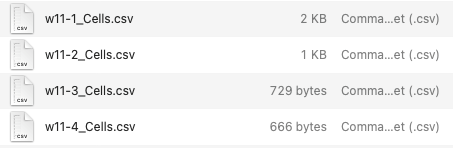

# Fluorescence quantification of protein reporters (How to use)

## Before start
- Download the repository or the content of this folder.
- unzip compressed `.tif` image files.

## Descriptions
### This simulation pipeline is divided into 2 parts:
- 1st part: outlines determination.
- 2nd part: extraction of xy coordinates from outlines.
- 3rd part: image analysis.

### Requirements:
- Fiji (ImageJ)
- R
- Optional: RStudio
- MATLAB (tested v R2018b or higher)
    - Image Processing Toolbox
    - Statistics and Machine Learning Toolbox


## User guide
## 1st part: outlines determination

### Procedure:
1. Open Fiji (ImageJ).
2. Open RIO Manager
    - Analyze > Tools > RIO Manger…
3. Using Fiji, open the image you want to analyze.
4. Use the “`polygon selections`” tool to manually draw outlines that delimit the oocyte borders. 
    - Each **oocyte outline** can be treated as an individual **R**egion **O**f **I**nterest (**ROI**).
    - To delimit oocytes, a max projection could be useful as gonad dimensions are variable along the z-plane.
    - Each oocyte outline (**ROI**) can be saved by clicking on the “`Add [t]`” bottom located in the _RIO Manager_ window, as shown below:<br><br>
    <br><br>
5. Once all outlines are added, select them and save them as a “`.zip`” file. Important: name the file with the same name as the image where the outlines are coming from.
    - In the case of only one outline, it will be saved as a “`.roi`” file.

## 2nd part: extraction of xy coordinates from outlines (required for image analysis in 3rd part)

### Example data and description:
Example images and outlines for this guide can be found in the folder `./example_image`<br>Images were obtained from 4 consecutive portions of a _C. elegans_ gonad live imaged. Following a proximo-distal axis, they are labeled as `w11-1` to `w11-4`
- `w11-1.tif`: image of oocytes minus 1 to minus 9.
- `w11-1.zip`: outlines of oocytes minus 1 to minus 9.

- `w11-2.tif`: image of oocytes minus 10 to minus 17.
- `w11-2.zip`: outlines of oocytes minus 10 to minus 17.

- `w11-3.tif`: image of oocytes minus 18 to minus 21.
- `w11-3.zip`: outlines of oocytes minus 18 to minus 21.

- `w11-4.tif`: image of oocytes minus 22 to minus 25.
- `w11-4.zip`: outlines of oocytes minus 22 to minus 25.

    

### Procedure:
6. Data should be organized in a folder as just shown above:<br>For each `“name”.zip` outline file, a matching `“name”.tif` image must be in the folder.
    - For this example, 4 images will be analyzed simultaneously.
7. Using Fiji, open the script `BATCH_improved_outlines_oocyte_extraction.ijm` (location: `./image_outlines`)
8. Run it and select the folder containing the images and oocyte outlines (ROIs) to analyze.<br>This script extracts the xy coordinates from the ROIs delimited and saved using Fiji.
    - **Output**: _`"name”_Cells.csv`_ files with xy coordinates of ROIs.<br>
    
9. Using R or RStudio, open the script `BATCH_automatic_outlines_reorganization_by_columns.R` (location: `./image_outlines`)
10. Run the script and select any file within the folder containing the images and ROIs to analyze.<br>This script reorganizes the outlines files, so they are readable in the image processing step.
    - **Output**: _`MOD_“name”_Cells.csv`_ files with reorganized xy coordinates of ROIs.<br>
    

### How to modify `BATCH_improved_outlines_oocyte_extraction.ijm`
```java
    //... Modify if needed (File Identifiers)... 
	file_ext = "zip"; // ROI file extension
    //...

    // Only line 2 should be modified. If needed replace “zip” by “roi”.
```


## 3rd part: mage analysis

### Requirements:
- MATLAB v R2018b or higher
    - Required toolboxes:<br>Image Processing Toolbox<br>Statistics and Machine Learning Toolbox

### Set up:
Copy the scripts provided (`./image_analysis_scripts`) to the MATLAB folder (usually located in Documents directory).

### Prcedure:
11. Open MATLAB
12. Run `car1_Script_granules_by_oocyte_sphericity.m`
    - To run the script, type `car1_Script_granules_by_oocyte_sphericity` in the command window and press enter, as shown below:<br>
    
13. Select the folder containing the images and organized oocyte outlines (from **step 10**; _`MOD_“name”_Cells.csv`_ files).


## Outputs:
This image analysis script will yield the results shown below:


## How to modify: `car1_Script_granules_by_oocyte_sphericity.m`

```matlab
    %% script to analyzed CAR-1 in live worms
    
    % file identifiers
    image_file.GFP  = '*.tif';
    image_file.ROIs = 'MOD*Cells.csv';
    
    
    % Segmentation parameters
    clear parameters
    parameters.quantile = 0.95; % BGD approximation quantile for initial filtering, recommended values: 0.9 to 0.95.
    % thresholding 
    parameters.threshold_granules = 0.6; % values are between 0 and 1, one is likely to be a pixel that corresponds to granules
    % excluding small objects
    parameters.small_objects_size = 32; % objects smaller than the value (pixels) will be excluded
    
    % Description_ of _ stack
    % there possible setting for acquire z-stacks are:
    % in focus: acquisition within the gonad’s z-plane boundaries.
    % out of focus: slides out of gonad focus
    %	1. Whole gonad with frames out of focus
    %	2. half gonad with initial frames out of focus
    %	3. Z-Stack in focus
    slides_out_of_focus = 0;    % yes = 1, No = 0
    half_gonad          = 1;    % yes = 1, No = 0
    
    pixel_size_in_x_and_y   = 0.0670922;    % micro meters
    pixel_size_in_z         = 0.5;          % micro meters
    

    % Flags for specific analysis
    clear flags
    flags.Gauss = 0; % 1 if BGD smoothing should be performed
```
