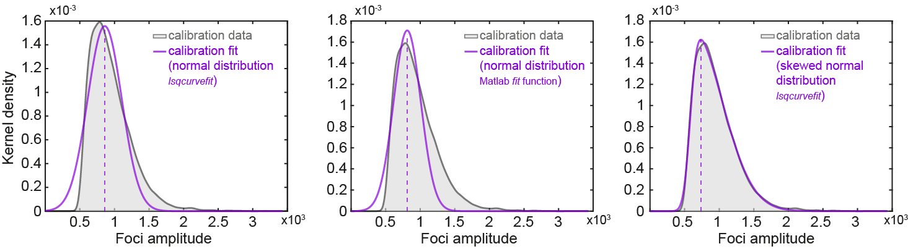

# Nanoclusters curve-fitting (How to use)

## Before start
- Download the repository or the content of this folder.

## Requirements and set up
### Requirements:
- Tested in MATLAB v R2018b or higher
    - Required toolboxes:<br>Image Processing Toolbox<br>Statistics and Machine Learning Toolbox

### Set up:
Copy the scripts provided (`./curve-fitting-scripts`) to the MATLAB folder (usually located in Documents directory).
<br><br>

## This script performs the following analysis:
- ### Inputs: two comma-separated values (CSV) tables
    - **Calibration data or single molecule data** - table with intensity amplitudes of single mRNA molecules (i.e.: smFISH spots at low mRNA density).<br>Should contain one column with the following data:
        - "**AMP**": intensity amplitudes of calibration data (detected smFISH spots).<br>
        
    - **Experimental data** - table with intensity amplitudes of experimental data (i.e.: smFISH spots in oocytes).<br>Should contain three columns with the following data:
        - "**Image**": unique identifiers for each image in the dataset.
        - "**CELL_Oocyte**": unique identifiers for each cell/oocyte/ROI in the dataset.
        - "**AMP**": intensity amplitudes of experimental data (detected smFISH spots).<br>
        

- ### Analysis:
    1. The distribution of amplitudes in the calibration data will be fitted to an skewed gaussian distribution (curve-fitting: lsqcurvefit - Least Squares).<br>
    
        - Calibration data fit examples. Skewed normal distribution yields a better fit.
    <br><br>
    - The distribution of amplitudes in the experimental data will be fitted to an skewed gaussian model of two components, where the first curve estimates the single molecules (based on the calibration data) and the second curve estimates the nanoclusters.<br>
    
        - Experimental data fit examples. Examples of single-molecule and nanocluster fitting.
    <br>
- ### Outputs
    - Number of single molecules and number of molecules within nanoclusters.<br>
    
    <br><br><br>

## User guide
### Data provided
- **Calibration data** (location: `./example-data/calibration_data.csv`):
    ```matlab
    .csv file with column "AMP" among others % (i.e.: obtained using FISH-quant).
    ```
- **Experimental data**  (location: `./example-data/experimental_data.csv`):
    ```matlab
    .csv file with columns "Image", "CELL_Oocyte", "AMP", among others % (i.e.: obtained using FISH-quant).
    ```
<br>

### Analysis (Procedure):
1. Open MATLAB.
2. In the command window type:<br>`script_fit_nano_clusters`<br>and then press enter.
3. Select the **calibration data** .csv file.
4. Select the **experimental data** .csv file.
5. Results are saved in the folder where **calibration data** is located.

#### The default parameters of the script include:
```matlab
    % ==== parameters for fitting
    ...
    
    % sampling
    parameter.pdf_step       = 0.5; % step for pdf evaluation from min : pdf_step : max(data)
    parameter.pdf_Band_Width = 40;  % kernel band width
    parameter.peak_fixed     = 1;   % fixed peak at boundary: force curved-fitted parameters of calibration data to be fixed in the skewed gaussian model (Yes=1, No=0).
    parameter.pdf_start      = 0;   % starting pdf from 0

    % show plots of fitted data
    show.plots           = 0; % Yes= 1, No=0
    show.display_range   = 5; % display range: number of molecules
    
    ...
```
pdf: probability density function.<br><br>

#### To change this:
- Type in the command window:<br>
`edit script_fit_nano_clusters`<br>
- Press enter.
- Then, default values can be manually modified (lines # 5 to # 13).

## Outputs:

### Provided output examples:
The fitting results, for the example data provided in this tutorial, are included (location: `./example-data-fitted`).
