# Quantification of smFISH images (How to use)

## Before start
- Download the repository or the content of this folder.
- For Github downloads: example smFISH images (large files) are provided as '`.tif.txt`'. A link to download the images is within the text files.
    - https://doi.org/10.17632/8jvrnztdvc.1 (location: `smFISH images quantification > example_image`).

## Descriptions
### This quantification pipeline is divided into 5 parts:
- 1st part: oocytes outlines delimitation and extraction.
- 2nd part: image preprocessing.
- 3rd part: condensates segmentation.
- 4th part: generation of outlines and filtered images for smFISH spots detection in the cytosol.
- 5th part: smFISH spots detection and filtering.

### Requirements:
- MATLAB (tested v R2018b or higher)
    - Required toolboxes:<br>Image Processing Toolbox<br>Statistics and Machine Learning Toolbox<br>Parallel Computing Toolbox<br>Curve Fitting Toolbox<br>Optimization Toolbox
    - Additional requirements:<br>FISH-quant (1,2,#)<br># `https://bitbucket.org/muellerflorian/fish_quant/src/master/`
- Fiji (ImageJ)
- R
- Optional: RStudio

### Set up:
* Copy the scripts provided (`./scripts_smFISH_quantification`) to the MATLAB folder (usually located in Documents directory).
    - Note: overlapping code scripts from other quantifications do not need to be replaced.
* Install FISH-quant:
    - Go to `https://bitbucket.org/muellerflorian/fish_quant/src/master/` (1,2).
    - Click Downloads and then download the repository (1,2).
    - Unzip the file in the MATLAB folder (Documents directory) (1,2).
    - Go to `./Documents/MATLAB/FISH_quant/Documentation` (1,2).
    - Open `FISH-QUANT__Tutorials.pdf` (1,2).
    - Follow the section **1.1 Install FISH-quant for Matlab** (1,2).

### Set up:
### How does this pipeline work?

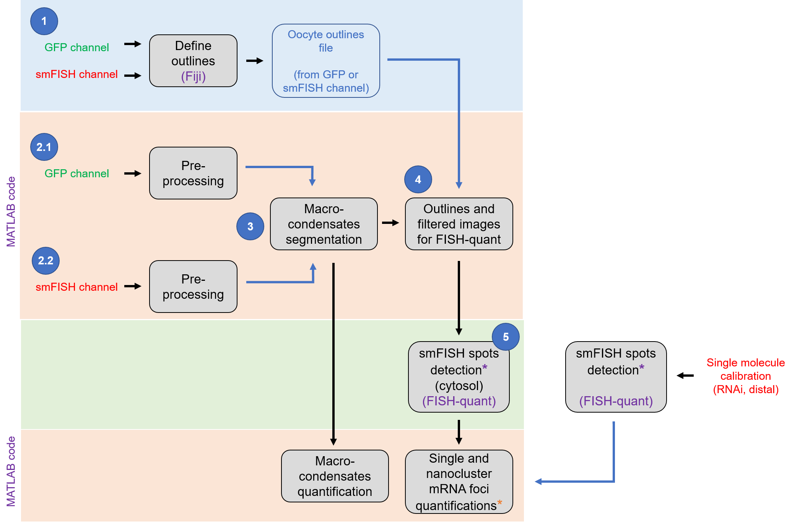

**Figure 1.** smFISH image quantification pipeline. It uses Fiji, FISH-quant, and custom MATLAB code.<br>(*) These steps can be done in batch. For the rest of steps, several MATLAB sections can be opened simultaneously.

### Provided image examples
The image data is provided at `./example image`<br>
It consists of two channels (already separated as independent images):
- GFP channel: “`w4_GFP.tif`”
- smFISH channel: “`w4_Spn4.tif`”

An example oocyte outlines file (see Fig. 1) is also provided: 
- Oocyte outlines: “`w4_GFP.zip`”<br><br>

## User guide
## 1st part: oocyte outlines delimitation and extraction
### Requirements:
- Fiji (Image J)
- R
- Optional: RStudio

### Outlines delimitation
### Procedure:
1. Open Fiji (ImageJ).
2. Open RIO Manager
    - Analyze > Tools > RIO Manger…
3. Using Fiji, open the image you want to analyze.
4. Use the “`polygon selections`” tool to manually draw outlines that delimit the oocyte borders. 
    - Each **oocyte outline** can be treated as an individual **R**egion **O**f **I**nterest (**ROI**).
    - To delimit oocytes, a max projection could be useful as gonad dimensions are variable along the z-plane.
    - Each oocyte outline (**ROI**) can be saved by clicking on the “`Add [t]`” bottom located in the _RIO Manager_ window, as shown below:<br><br>
    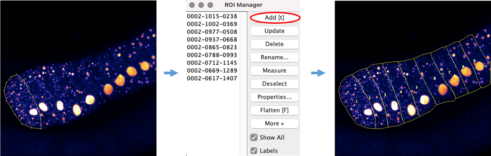<br><br>
5. Once all outlines are added, select them and save them as a “`.zip`” file. **Important:** name the file with the same name as the image where the outlines are coming from.
    - In the case of only one outline, it will be saved as a “`.roi`” file.

### Extraction of xy coordinates from outlines (required for 4rd part)
### Example data and description:
Example images and outline file for this guide can be found in the folder `./example_image`<br>Images were obtained imaging a smFISH experiment. It consists of two channels (already separated as independent images):
- GFP channel: “`w4_GFP.tif`”
- smFISH channel: “`w4_Spn4`”

An example oocyte outlines file (see Fig. 1) is also provided. You can obtain it as explained in the previous section (**Outlines determination**)
- Oocyte outlines: “`w4_GFP.zip`”
    
    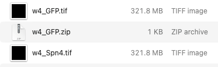

### Procedure:
6. Data should be organized in a folder as just shown above:<br>For each `“name”.zip` outline file, a matching `“name”.tif` image must be in the folder.
    - For this example, only one outline file will be processed, alternatively several outline files with their corresponding images can be processed simultaneously.
7. Using Fiji, open the script `BATCH_improved_outlines_oocyte_extraction.ijm` (location: `./image_outlines`)
8. Run it and select the folder containing the images and oocyte outlines (ROIs) to analyze.<br>This script extracts the xy coordinates from the ROIs delimited and saved using Fiji.
    - **Output**: _`"name”_Cells.csv`_ files with xy coordinates of ROIs.<br>
    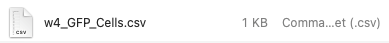
9. Using R or RStudio, open the script `BATCH_automatic_outlines_reorganization_by_columns.R` (location: `./image_outlines`)
10. Run the script and select any file within the folder containing the images and ROIs to analyze.<br>This script reorganizes the outlines files, so they are readable in the image processing step.
    - **Output**: _`MOD_“name”_Cells.csv`_ files with reorganized xy coordinates of ROIs.<br>
    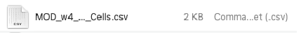

### Optionally
You can do this reorganization manually as shown below:

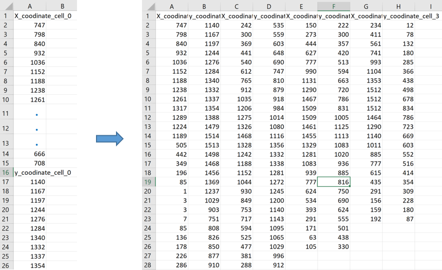<br><br>


### How to modify `BATCH_improved_outlines_oocyte_extraction.ijm`
```java
    //... Modify if needed (File Identifiers)... 
	file_ext = "zip"; // ROI file extension
    //...

    // Only line 2 should be modified. If needed replace “zip” by “roi”.
```


## 2nd part: image preprocessing

### Procedure. For each channel, GFP and smFISH, do the following:
11. Open MATLAB
12. In the command window type:
    - `edit smFISH_preprocessing_Script`<br>
    This file will open:
    ```matlab
        %%  ----------------- smFISH preprocessing
        % Description of the stack
        % There are two possibilities: 
        % = 1 if stack has beginning and ending frames out of focus (whole gonad)
        % = 0 if stack is in focus (usually a z-section within the gonad)
        is_stack_out_of_focus = 1; % 
        smFISH_channel = 0; % type of image: if FISH  = 1, if GFP = 0
        
        % Parameters
        quantile_BGD_subtraction = 0.9; % quantile to subtract BGD value (initial filtering), 0 if it's unknown
        % if quantile_BGD_subtraction = 0, two BGD approximations are computed:
        different_BGD_approximations = 1; % 1 for different functions, 2 for same function with different mask sizes  
        
        % image ranking
        block_size_for_image_ranking = 2; % faster results with larger values like 4, 8, 16; but less detail
        
        % run
        smFISH_image_Preprocessing
    ```
13. If needed, modify the parameters for preprocessing, then save changes:
    - Line # 6: `is_stack_out_of_focus`<br>
    This scrip is optimized for two options, either a complete gonad in the z-plane with out-of-focus planes (`is_stack_out_of_focus = 1`), or a z-section with NO out-of-focus planes (`is_stack_out_of_focus = 0`).

    - Line # 7: `smFISH_channel`<br>
    Make `smFISH_channel = 1`, for  smFISH channel<br>
    Make `smFISH_channel = 0`, for  GFP channel

    - Line # 10: `quantile_BGD_subtraction`<br>
    `quantile_BGD_subtraction = 0.9` is recommended for most cases.<br>
    To select a value during the preprocessing make `quantile_BGD_subtraction = 0`

    - Line # 15: `block_size_for_image_ranking = 2`<br>
    Faster results with larger values like 4, 8, 16; but less detail.

14. In the command window type: `smFISH_preprocessing_Script`
15. The script will ask you to select either a GFP or smFISH image.
    - The preprocessing steps are the same, the distinction is only used to name the outputs properly.
16. If `is_stack_out_of_focus = 1`, The script determines the oocyte z-boundaries of the stack (oocytes z-edges), as follows:

    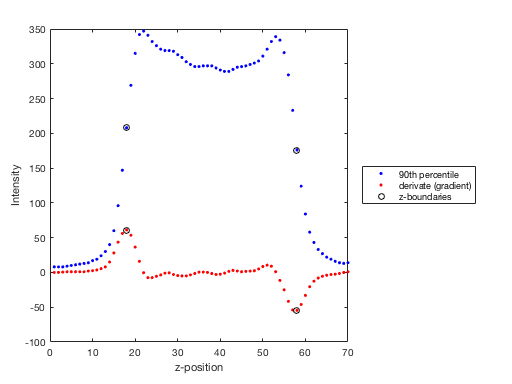

    *** This method won’t work if the z-stack acquisition exhibits bleaching in the z-plane or if it doesn’t have out-of-focus frames both at the beginning and end of the z-stack.<br><br>
17. Then:

|if `quantile_BGD_subtraction = 0.9`|if  `quantile_BGD_subtraction = 0`|
|---|---|
|- The script will subtract the background.<br>- Image ranking will be performed.<br>- And output will be saved.|- The script will perform two background approximations (BGD1 and BGD2):<br>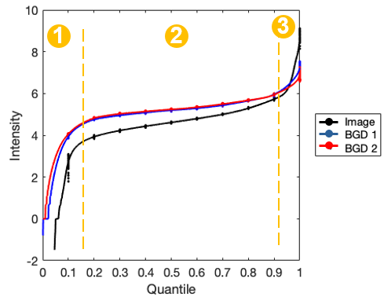<br>The curve displays three regions:<br>**1.** slide background,<br>**2.** oocyte background.<br>**3.** brighter objects like smFISH clusters.<br>`quantile_BGD_subtraction` should be the quantile that separates region **2** from region **3**.<br><br>By default, `quantile_BGD_subtraction = 0.9`<br>- Type in the command window the quantile you want.<br><br>- The script will subtract the background.<br>- Image ranking will be performed.<br>- And output will be saved.|

By channel the script will save a MATLAB workspace. For instance:
- `WS_name-smFISH-cahnnel_FISH.mat`
- `WS_name-GFP-cahnnel_GFP.mat`

## 3rd part: condensates segmentation

### Example data and description
For this step, the following files are required:
- location: `./example_image`
    - GFP channel image
    - smFISH channel mage
- location: `./example_image/output_image_preprocessing` (**2nd part**)
    - `WS_name-smFISH-cahnnel_FISH.mat`
    - `WS_name-GFP-cahnnel_GFP.mat`
- location: `./example_image/output_outlines_reorganization` (**1st part**)
    - `MOD_“name-channel”_Cells.csv`

For this example, the, the following files are provided:
- `w4_Spn4.tif`
- `w4_GFP.tif`
- `WS_w4_Spn4_FISH.mat`
- `WS_w4_GFP_GFP.mat`
- `MOD_w4_GFP_Cells.csv`

### Procedure
18. Make a folder with the 5 elements described in “**example data and description**”.
19. Type in the command window:<br>
    `edit smFISH_Segmentation_Outlines_Script`
20. The script below will appear (If needed, modify accordingly to instructions). Then save changes.

```matlab
    %  ----------------- smFISH image analysis (segmentation)
    %% File ID indicators
    files = struct; % do not modify
    files.FISH_img = '*Spn4*.tif';    % file identifier for smFISH image
    files.FISH_ws  = '*FISH*.mat';    % file identifier for smFISH workspace
    files.GFP_img  = '*GFP*.tif';     % file identifier for GFP image
    files.GFP_ws   = '*GFP*.mat';     % file identifier for GFP workspace
    files.outlines = 'MOD*Cells.csv'; % file identifier for cell outlines
    
    %% Microscope parameters
    % Define pixel size in nm
    pixel_size = struct; % do not modify
    pixel_size.xy = 49;  % pixel size in x and y
    pixel_size.z  = 250; % pixel size in z
    
    % Acquisition parameters
    s = struct; % do not modify
    s.Em    = 568;        % cy3 Emission 
    s.Ex    = 554;        % cy3 Excitation
    s.NA    = 1.4;        % Numerical aperture
    s.RI    = 1.518;      % Diffractive index
    s.type  = 'confocal'; % Microscope type
    s.Pixel = pixel_size;
    
    %% Segmentation parameters
    options = struct; % do not modify
    options.Int_Threshold_GFP  = 0.6; % Normalized [0 - 1] Intensity Threshold: GFP
    options.Int_Threshold_FISH = 0.8; % Normalized [0 - 1] Intensity Threshold: smFISH
    options.Volume_Threshold   = 32;  % Volume threshold for segmentation (in pixels)
    options.Dilate_Granule     = 1;   % if 1, condensate are dilated to include edges 
    
    %% Outlines settings
    options.FQ_outline       = 1; % if 1, outlines for FQ are an output
    options.Exclude_Granules = 1; % if 1, creates images and outlines without granules
    options.Save_Coordinates = 1; % if 1, segmented objects coordinates for are saved
    
    %% Alternative masking
    Filt_options = struct;  % do not modify
    Filt_options.gauss2x  = 1;
    Filt_options.bgd_xy   = 5;
    Filt_options.bgd_z    = 5;
    Filt_options.spots_xy = 0.1;
    Filt_options.spots_z  = 0.1;
    Filt_options.output   = 0;
    options.Filt          = Filt_options;
    
    %% RUN
    Segmentation_Outlines_run
```

- The following values should be adapted to different experimental conditions, for example; a different mRNA target, type of microscopy, among others. However, should be maintained if you are analyzing the same experiment.
    - `options.Int_Threshold_GFP = 0.6`<br>
    Normalized intensity threshold for segmentation of the GFP image.<br>
    Values accepted from 0 to 1. Values close to 0 would be background while values close to 1 will be condensates.
    - `options.Int_Threshold_FISH = 0.8`<br>
    Normalized intensity threshold for segmentation of the smFISH image.<br>
    Values accepted from 0 to 1. Values close to 0 would be background while values close to 1 will be condensates.
    - `options.Volume_Threshold = 32`<br>
    Volume threshold for segmentation (in pixels).
    - `options.Dilate_Granule = 1`<br>
    if = 1, condensates are dilated to make sure edges are included. This is a very important step as edges not segmented might generate false positives while detecting cytosolic spots. **IMPORTANT:** Dilation needs to be done by condensate, so this step might take time depending on computer specifications.<br><br>
- If you need to make test without running the whole script (specially the dilation that takes most of the time),<br>
in step 18 type in the command window:<br>
`edit smFISH_Segmentation_Script_TEST`<br><br>
21. Accordingly, type in the command window:<br>
`smFISH_Segmentation_Outlines_Script`<br>
or<br>
`smFISH_Segmentation_Script_TEST`
22. Select the folder created in step 18.

## Outputs

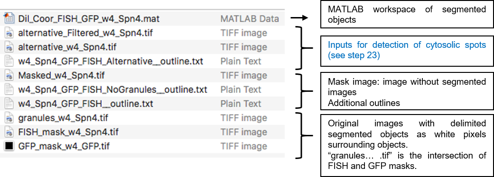<br><br>

## 4th and 5th part:<br>Generation of outlines and filtered images for smFISH spots detection in the cytosol,<br>smFISH spots detection and filtering.
The segmentation script also generates the outlines, raw image, and filter image required to run FISH-quant (1-3) to detect smFISH spots. For more information, refer to the already published manuals (1-3).

23. In order to detect cytosolic smFISH spots after running this segmentation (Fig. 1), please use the following files as FISH-quant inputs (**outputs from 3rd part: condensates segmentation**):
- `alternative… .tif` image
- `alternative_Filtered… .tif` image
- `…Alternative__outline.txt` outline file
24. Once in FISH-quant(1-3), single or batch analysis modes, do not perform the filtering step.<br>If you want to modify the filtering parameters go to step **20** and make changes as follows:
    ```matlab
        %% Alternative masking
        Filt_options = struct;  % do not modify
        Filt_options.gauss2x    = 1;
        Filt_options.bgd_xy     = 5;   % Kernel BGD [pixel]: XY (see FISH-quant)
        Filt_options.bgd_z      = 5;   % Kernel BGD [pixel]: Z  (see FISH-quant)
        Filt_options.spots_xy   = 0.1; % Kernel SNR [pixel]: XY (see FISH-quant)
        Filt_options.spots_z    = 0.1; % Kernel SNR [pixel]: Z  (see FISH-quant)
        Filt_options.output	    = 0;
        options.Filt            = Filt_options
    ```
25. Use FISH-quant as previously described (1-3)
- Recommendations
    - Set analysis parameters with the original images
    - Create your file with settings (see FISH-quant documentation1,2,3)
    - Use batch mode to run the images (step 23)
    - Select Use filtered images<br><br>

## Integration with FISH-quant
Condensates quantification (Fig.1, see Supplementary Information (4)) is performed after the detection of cytosolic smFISH spots.

To avoid any detection of spots within condensates by FISH-quant, the output images (step **22** and **23**) are labeled, so:
- The only possible detection of false positive smFISH sports occurs at condensate edges.
- After detection in FISH-quant (1-3), false positive spots at the condensate edges can be filtered out because they would have a unique and very high “`Pixel intensity (Raw)`” value that: (1st) it is not present in the image and (2nd) it is biased to the right side as shown in the following example:

Before filtering out false positives from condensates edges

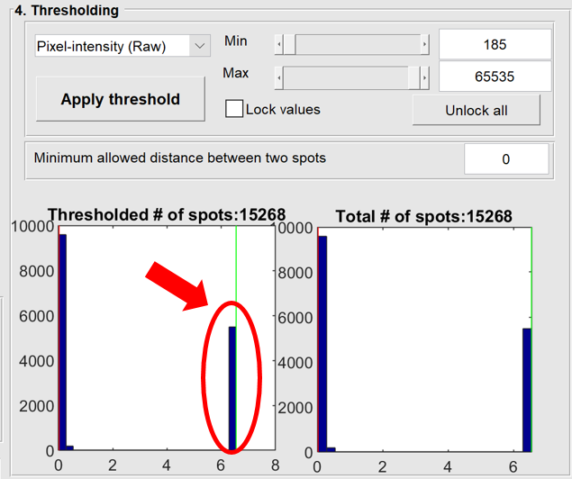<br>
Image from FISH-quant v3 main interface (1-3).<br><br>

After filtering out false positives from condensates edges

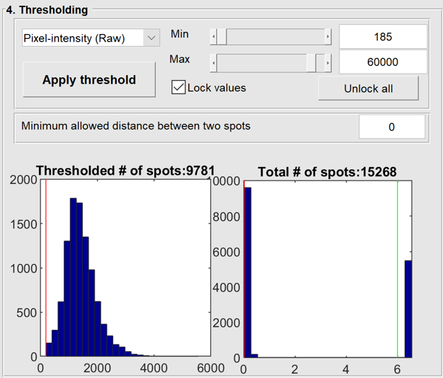<br>
Image from FISH-quant v3 main interface (1-3).


## References
1. Mueller, F., Senecal, A., Tantale, K. et al. FISH-quant: automatic counting of transcripts in 3D FISH images. Nat Methods 10, 277–278 (2013).
2. Tsanov, N., Samacoits, A., Chouaib, R. et al. smiFISH and FISH-quant – a flexible single RNA detection approach with super-resolution capability, Nucleic Acids Research 44 (22), e165 (2016).
3. `https://bitbucket.org/muellerflorian/fish_quant/src/master/`
4. Cardona et al., Self-demixing of mRNA copies buffers mRNA:mRNA and mRNA:regulator stoichiometries, Cell (2023), https://doi.org/10.1016/j.cell.2023.08.018
